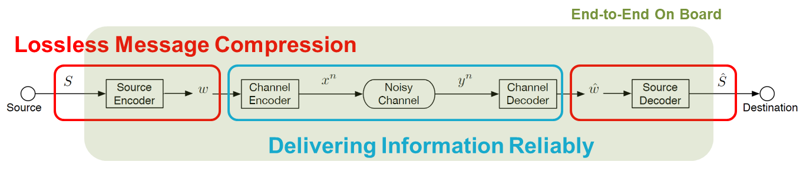
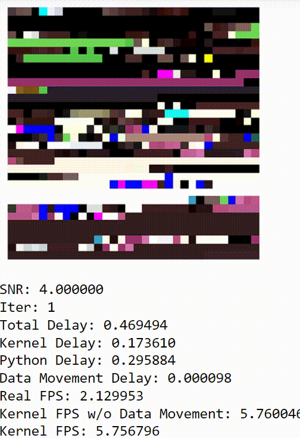
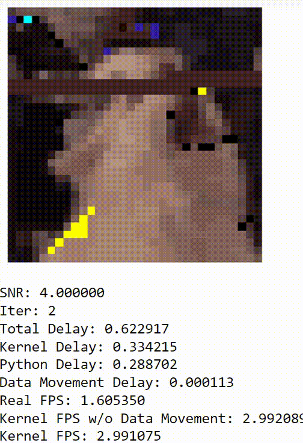
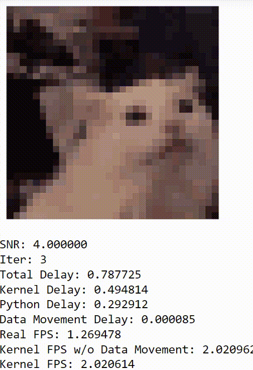
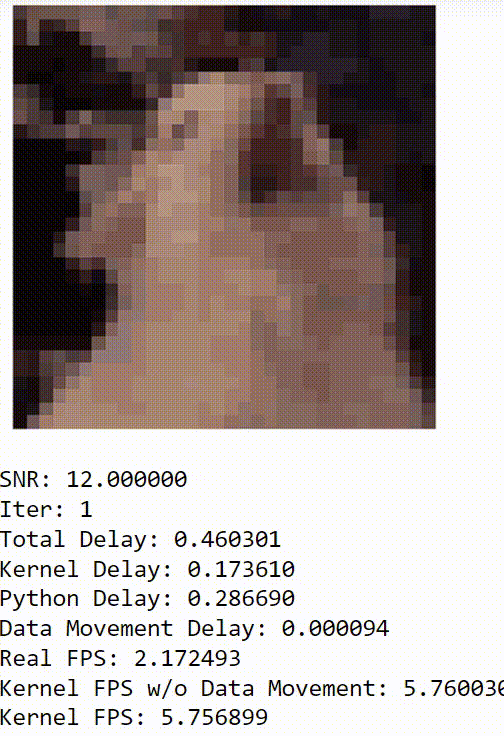

# Project Goal
### Full run including Encoding, Channel Simulation, and Decoding
## This Project contains three modules below
#### a.	Source Coding (Image Compression) – QOI (Quite OK Image Format)
#### b.	Channel Coding (Error Correction Code) – Polar Code
#### c.	Simulated AWGN Channel

## DEMO
### &nbsp; Low SNR / Low Iter &emsp;&emsp; Low SNR / Moderate Iter &emsp;&ensp; Low SNR / High Iter &emsp;&emsp;&emsp; High SNR / Low Iter
 &ensp;  &ensp;  &ensp; 
